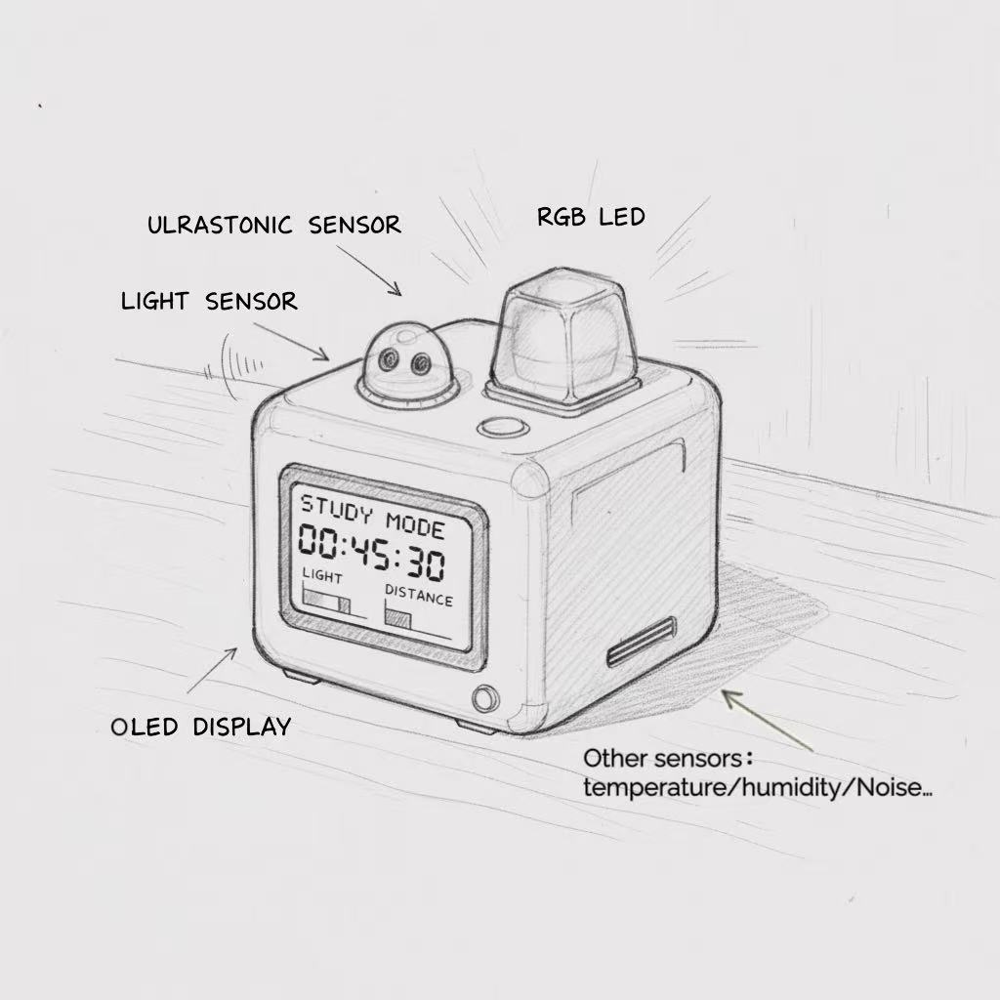
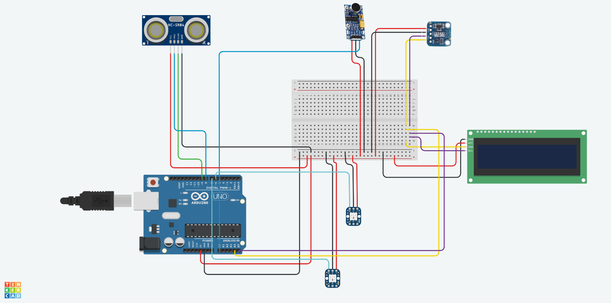
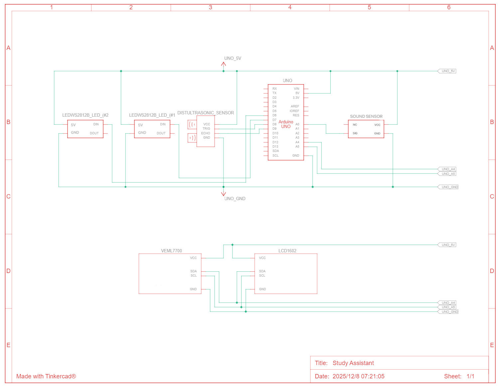
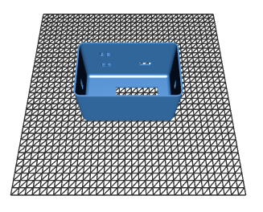

# Study Assistant

The **Study Assistant** is a smart, sensor-based desktop companion designed to improve learning efficiency and promote healthier study habits.  
By monitoring environmental and behavioral factors—such as brightness, noise, distance, and presence, it provides real-time feedback through an RGB LCD screen and LED indicators.  
The device encourages proper posture, ideal study intervals, and timely breaks.

---

## 📌 Overview

This project integrates several sensing modules, a feedback system, and a 3D-printed enclosure.  
Key capabilities include:

- Real-time environmental monitoring (lux & noise)
- Ultrasonic-based user presence and distance measurement
- Dynamic recommended study duration
- Dynamic rest duration based on environment quality
- Automatic light control
- Multi-state LED feedback (posture/noise/rest)
- LCD visual interface with rotating pages
- Smart Rest Mode with energy-saving behavior

---

## ✨ Key Features

### 🎯 **Smart Focus Tracking**
- Detects when the user is present and studying
- Tracks:
  - Current focus session duration
  - Total accumulated study time (daily)
- Compares progress against a **dynamically-calculated recommended study duration**

### 😴 **Intelligent Rest Mode**
Triggered when continuous study exceeds the recommended duration.

During Rest Mode:
- Status LED locks to **red**
- Environment LED is **turned off**
- LCD displays:
Rest: <elapsed> / <required> minutes
Leave desk...

- After required rest time:
- State changes to **Rest Finished**
- Status LED turns **orange** until the user returns

### 📟 **LCD Dual-Page Display**
The LCD cycles between two pages when not in rest mode:

**Page 0 — Study Progress**
Total: <total_minutes>m
(<current_segment> / Rec:<recommended>)

**Page 1 — Environment Readings**
Lux: <brightness>
Noise: <raw_value>

### 💡 **LED Status Indicators**
- 🟢 **Green** — user present, environment normal  
- 🔵 **Blue** — user too close to the screen  
- 🟡 **Yellow** — environment too noisy  
- 🔴 **Red** — rest required  
- 🟠 **Orange** — rest finished (waiting for user return)  

LED color is preserved when the user leaves (except rest-related states).

---

## 🧠 Sensor Logic Summary

| Sensor | Function | Usage |
|--------|----------|--------|
| **Ultrasonic (HC-SR04)** | Distance & presence | Posture, presence detection, rest logic |
| **VEML7700** | Ambient brightness | Automatic light control, recommendation tuning |
| **Microphone (analog)** | Noise level | Environment quality analysis & LED feedback |
| **Time (millis)** | Study/rest tracking | Non-blocking timing system |

Dynamic recommended study time and rest duration both depend on **light**, **noise**, and **distance** conditions.

---
# 🖼️ Design Documents (in `/Documents/`)

All design drawings, early concept sketches, electronics documentation, and PCB design files are stored in:

/Documents/

These materials illustrate the full development process from concept → electronic design → PCB layout.

---

## ✏️ Concept Sketch

The initial sketch visualizes the first idea of the Study Assistant, including enclosure proportion, sensor placement, and user-facing interactions.

---

## 🧩 Schematic Diagram

The schematic documents all circuit connections including the ultrasonic sensor, VEML7700 brightness sensor, microphone input, I2C LCD, and indicator LEDs.
**Designed in Tinkercad.**

---

## 🟩 PCB Layout

The PCB layout converts the schematic into a manufacturable and compact board designed to fit inside the 3D printed shell.
**Designed in Tinkercad.**

---

# 🛠️ 3D Printed Shell (from `/Shell/`)

The Study Assistant enclosure includes a main shell and a detachable top cover.  
Both parts were modelled for 3D printing through *  Fusion 360* and designed to house all electronics securely.

---

### 🟦 Shell (Main Body)

**STL download:**  
https://github.com/CynthiaZHANGovo/casa0016/blob/main/Shell/Studybox2.0.stl

---

### 🟧 Shell Cover

**STL download:**  
https://github.com/CynthiaZHANGovo/casa0016/blob/main/Shell/Study_Box_Cover.stl

---

### 🎃 Additional Decorative Models (Open-source Resources)

These optional decorative elements are sourced from open 3D model libraries and used for aesthetic enhancement:

- **Campfire decoration** — [open-source model](https://makerworld.com.cn/zh/models/672740-gou-huo-deng-mi-ni-ledgou-huo-tai-deng?from=search#profileId-617935)
- **Lamp shade decoration** — [open-source model](https://makerworld.com.cn/zh/models/1686858-fen-wei-deng?from=search#profileId-1854094)
- **Pumpkin lantern decoration** — [open-source model](https://makerworld.com.cn/zh/models/1678338-nan-gua-deng-zhao-zhi-xu-1xiao-shi-da-yin?from=search#profileId-1843353)

---

---

# 💻 Arduino Code (Final Version)

The complete Arduino sketch with all functions, detailed English comments, and structured serial output is located at:

/StudyAssistant

Direct link:  
👉 **[Study_Assistant_Final.ino](StudyAssistant)**

---

# 📂 Repository

Full project available at:  
👉 https://github.com/CynthiaZHANGovo/casa0016

---

# 👩‍💻 Author

**Xinyi Zhang**  Cyn Zhang

GitHub: https://github.com/CynthiaZHANGovo  
UCL CASA0016

