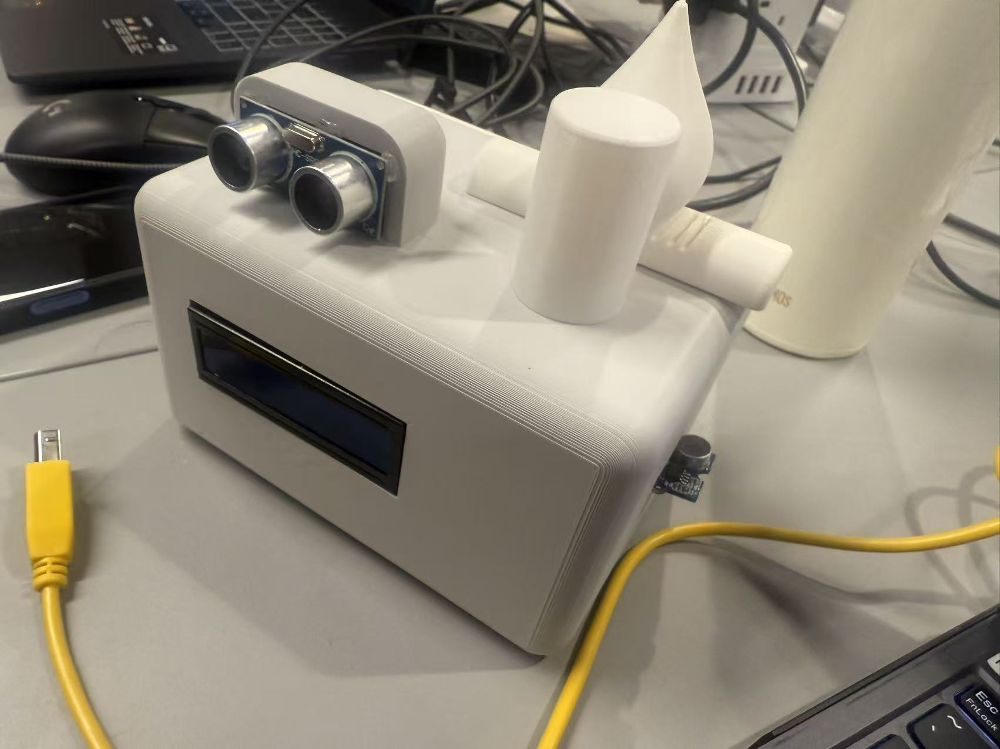

# Study Assistant

The **Study Assistant** is a smart, sensor-driven desktop companion designed to improve study efficiency and encourage healthier learning habits. It monitors brightness, noise, distance, and user presence, then provides real-time feedback through an RGB LCD and multi-color LED indicators.



---

## 📌 Overview

The Study Assistant integrates several sensors, a dynamic feedback system, and a custom 3D-printed enclosure. It automatically tracks focus time, recommends study durations, and enforces rest intervals based on environmental quality.

### Core Capabilities

* Real-time environmental monitoring (lux + noise)
* Ultrasonic-based presence and distance measurement
* Dynamic recommended study duration
* Dynamic rest duration
* Automatic environment light control
* Multi-state LED status feedback
* LCD dual-page interface
* Smart Rest Mode with power saving
* Refined behavior when distance is invalid (LEDs turn off unless noisy)

---

## ✨ Key Features

### 🎯 Smart Focus Tracking

* Detects when the user is present
* Measures:

  * Current study session duration
  * Total accumulated study time
* Continuously compares time against automatically calculated recommendations

### 😴 Intelligent Rest Mode

Triggered when continuous study exceeds recommended duration.

During Rest Mode:

* Status LEDs locked to **red**
* Environment LEDs **off**
* LCD shows:

  * `Rest: <elapsed> / <required> m`
  * `Leave desk...`
* After required rest time: system enters **Rest Finished** state

  * Status LEDs turn **orange** until the user returns

### 🔄 Updated LED Behavior

Latest logic:

* **Green** — user present & environment normal
* **Blue** — user too close
* **Yellow** — environment too noisy
* **Red** — rest required
* **Orange** — rest finished (waiting for user)
* **No Delay** — LED color now updates instantly
* **Invalid distance** — *LED stays off unless noise is high*

### 📟 LCD Dual-Page System

When not resting, the LCD alternates every 2 seconds:

**Page 0 — Study Progress**

```
Total: <minutes>
(<current> / Rec:<recommended>)
```

**Page 1 — Environment**

```
Lux: <value>
Noise: <value>
```

---

## 🧠 Sensor Logic Summary

| Sensor            | Purpose             | Usage                                                        |
| ----------------- | ------------------- | ------------------------------------------------------------ |
| HC-SR04           | Distance & presence | posture, presence, rest logic                                |
| VEML7700          | Brightness          | environment quality, rest & study tuning, auto light control |
| Analog microphone | Noise               | environment quality, LED feedback                            |
| millis()          | Timing              | non-blocking session & rest tracking                         |

Both study and rest durations adapt dynamically to environmental conditions.

---

# 🖼️ Design Documents (in `/Documents/`)

All design drawings, early concept sketches, electronics documentation, and PCB design files are stored in:

/Documents/


These materials illustrate the full development process from concept → electronic design → PCB layout.

---

## ✏️ Concept Sketch

The initial sketch visualizes the first idea of the Study Assistant, including enclosure proportion, sensor placement, and user-facing interactions.


---

## 🧩 Schematic Diagram

The schematic documents all circuit connections including the ultrasonic sensor, VEML7700 brightness sensor, microphone input, I2C LCD, and indicator LEDs.
**Designed in Tinkercad.**


---

## 🟩 PCB Layout

The PCB layout converts the schematic into a manufacturable and compact board designed to fit inside the 3D printed shell.
**Designed in Tinkercad.**


---

# 🛠️ 3D Printed Shell (from `/Shell/`)

The Study Assistant enclosure includes a main shell and a detachable top cover.  
Both parts were modelled for 3D printing through *Fusion 360* and designed to house all electronics securely.

---

### 🟦 Shell (Main Body)


**STL download:**  
https://github.com/CynthiaZHANGovo/casa0016/blob/main/Shell/Studybox2.0.stl

---

### 🟧 Shell Cover


**STL download:**  
https://github.com/CynthiaZHANGovo/casa0016/blob/main/Shell/Study_Box_Cover.stl

---

### 🎃 Additional Decorative Models (Open-source Resources)

These optional decorative elements are sourced from open 3D model libraries and used for aesthetic enhancement:

- **Campfire decoration** — [open-source model](https://makerworld.com.cn/zh/models/672740-gou-huo-deng-mi-ni-ledgou-huo-tai-deng?from=search#profileId-617935)
- **Lamp shade decoration** — [open-source model](https://makerworld.com.cn/zh/models/1686858-fen-wei-deng?from=search#profileId-1854094)
- **Pumpkin lantern decoration** — [open-source model](https://makerworld.com.cn/zh/models/1678338-nan-gua-deng-zhao-zhi-xu-1xiao-shi-da-yin?from=search#profileId-1843353)


---

## 🎬 Demo Videos

This section demonstrates the Study Assistant in real-world use, including both general functionality and dynamic mode switching behavior.

---

### ▶️ Demo 1 — Full Functionality Overview

Demonstrates the **overall workflow and core features** of the Study Assistant, including:

* Presence detection
* Study time tracking
* Environmental monitoring
* Noise warning
* Distance warning
* LCD dual-page display
* LED status feedback

📺 **Watch video:**
[https://www.youtube.com/watch?v=R-oBgMGgS7g](https://www.youtube.com/watch?v=R-oBgMGgS7g)

[](https://www.youtube.com/watch?v=R-oBgMGgS7g)


### ▶️ Demo 2 — Mode Switching & Status Transitions

Focuses on **different system modes and real-time transitions**, including:

* Normal study mode
* Rest mode activation
* Rest finished state

📺 **Watch video:**
[https://youtu.be/XXJL6YK80Yg](https://youtu.be/XXJL6YK80Yg)

[](https://youtu.be/XXJL6YK80Yg)

---

# 💻 Arduino Code (Final Version)

The complete Arduino sketch with all functions, detailed English comments, and structured serial output is located at:

/StudyAssistant


Direct link:  
👉 **[Study_Assistant_Final.ino](StudyAssistant)**

---


# 📂 Repository

Full project available at:  
👉 https://github.com/CynthiaZHANGovo/casa0016

---

# 👩‍💻 Author

**Xinyi Zhang**  Cyn Zhang

GitHub: https://github.com/CynthiaZHANGovo  
UCL CASA0016

